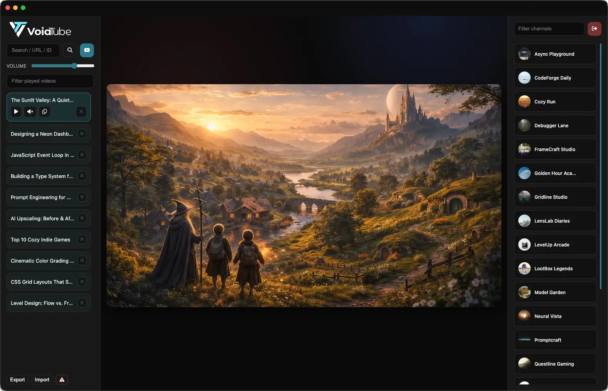
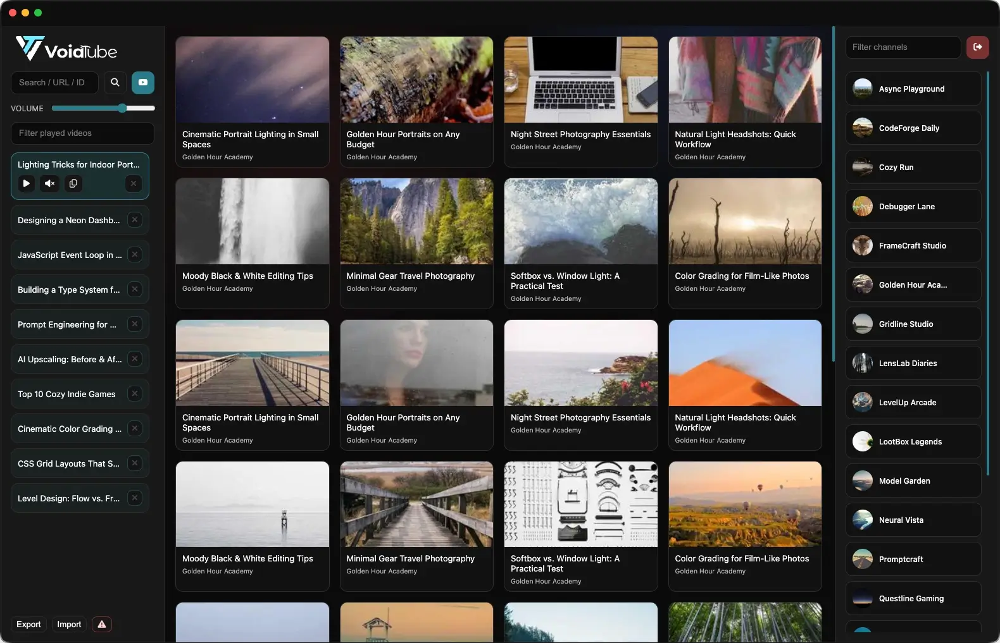
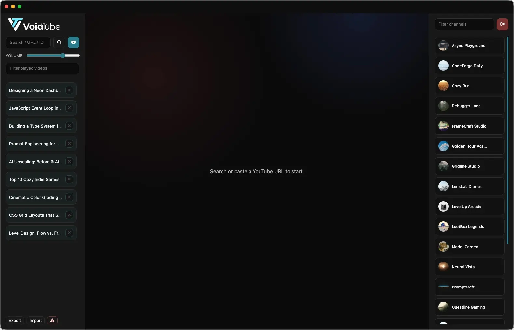

#  VoidTube

VoidTube is a focused desktop YouTube player. It keeps playback clean, puts your channels on the right, and a persistent play history on the left.

If you like the app and want to support it, feel free to buy me a coffee (PayPal link coming soon).

---

## Table of contents

- [What this app is for](#what-this-app-is-for)
- [How it works (short)](#how-it-works-short)
- [Screenshots](#screenshots)
- [Quick start](#quick-start)
- [Build (step by step)](#build-step-by-step)
- [Google Cloud setup (why this is needed)](#google-cloud-setup-why-this-is-needed)
- [Configuration](#configuration)
- [Notes / limitations](#notes--limitations)
- [Project status / maintenance](#project-status--maintenance)
- [License](#license)

---

## What this app is for

VoidTube is a clean, distraction‑free way to watch YouTube on desktop:

- Play a single video in the main view, or browse search/channel results in a grid.
- Keep a local play history with resume position per video.
- Control volume globally from one slider.
- Browse your subscriptions in the right sidebar (ordered by your clicks / recency).
- Toggle a full, clean view for distraction‑free watching.
- If a video cannot be embedded, open it in the browser instead.

## How it works (short)

VoidTube uses the YouTube IFrame Player API for playback.  
It uses the YouTube Data API for search, subscriptions, and channel browsing.  
Auth is handled via the OAuth device code flow (a safe, browser‑based login).


## Screenshots

<table border="0" cellspacing="10" cellpadding="0">
  <tr>
    <td colspan="2"></td>
  </tr>
  <tr>
    <td></td>
    <td></td>
  </tr>
</table>

_Demo images._

## Quick start

```bash
npm install
npm run dev
```

The app will launch in development mode.

## Build (step by step)

You do **not** need to be a programmer to build this.  
Just follow these steps:

1) Install Node.js (LTS is fine): https://nodejs.org
2) Download / clone this repository
3) Open a terminal in the project folder
4) Run:

```bash
npm install
npm run generate:icons
npm run build:mac
npm run build:win
npm run build:linux
```

Build output goes to `dist/`.

## Google Cloud setup (why this is needed)

YouTube does not allow apps to search subscriptions or access private data without a developer key.
That is why **each user needs their own Google Cloud project**.

It sounds scary, but it is just a few clicks and takes about 5 minutes.

### What you are creating

- A **Google Cloud project** (just a container for settings)
- A **YouTube Data API key** (for search and video data)
- An **OAuth Client ID** (so you can sign in safely)

### Step by step

1) Create a project:  
   https://console.cloud.google.com/

2) Enable **YouTube Data API v3**:  
   https://console.cloud.google.com/apis/library/youtube.googleapis.com

3) Create an OAuth Client ID:  
   https://console.cloud.google.com/apis/credentials  
   Recommended type: **TVs and Limited Input devices** (device code flow)

4) Create an API key on the same Credentials page.

5) Open VoidTube, go to the Sign In screen, and paste:
    - Client ID
    - Client Secret (optional but recommended)
    - API key

Helpful docs:
- YouTube Data API overview: https://developers.google.com/youtube/v3/getting-started
- OAuth device flow: https://developers.google.com/identity/protocols/oauth2/limited-input-device

## Configuration

You have two options:

1) **In‑app (recommended for builds)**  
   On the sign‑in overlay, fill in the three fields and sign in.
   The values are saved locally on your device.

2) **Local config / environment variables (dev use)**
    - `config.local.json` (git‑ignored). Example: `config.example.json`
    - Or env vars:
        - `YT_CLIENT_ID`
        - `YT_CLIENT_SECRET` (optional)
        - `YT_API_KEY`

## Notes / limitations

- Tokens are stored locally (not encrypted).
- API usage is subject to YouTube quota limits for your project.
- `config.local.json`, `build/`, and `dist/` are git‑ignored.

## Project status / maintenance

You can use this project for anything and for as long as you want. I am happy if it helps you.
This is a personal project, so do not expect heavy maintenance. I may fix serious bugs from time to time.
Contributions and forks are welcome.

## License

MIT.
