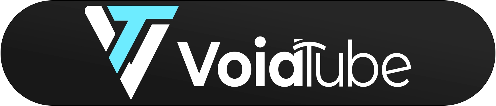

# VoidTube

VoidTube is a focused desktop YouTube player. It keeps playback clean, puts your channels on the right, and a persistent play history on the left.

## Project status / maintenance

You can use this project for anything and for as long as you want. I am happy if it helps you.
This is a personal project, so do not expect heavy maintenance. I may fix serious bugs from time to time.
Contributions and forks are welcome.

## What it does

- Play a single video in the main view, or browse search/channel results in a grid.
- Keep a local play history with resume position per video.
- Control volume globally from one slider.
- Browse your subscriptions in the right sidebar (ordered by your clicks / recency).
- Toggle a full, clean view for distraction-free watching.
- If a video cannot be embedded, open it in the browser instead.

## How it works (short)

VoidTube uses the YouTube IFrame Player API for playback.  
It uses the YouTube Data API for search, subscriptions, and channel browsing.  
Auth is handled via the OAuth device code flow.

## Install & run (dev)

```bash
npm install
npm run dev
```

The renderer is served from a local HTTP server (127.0.0.1) to provide a valid origin for the IFrame API.  
Default port is `38999` (falls back to `39000` if busy), so localStorage and tokens remain stable.

## Configuration

You have two options:

1) **In-app (recommended for builds)**  
On the sign-in overlay, fill in:
- **Client ID**
- **Client secret** (optional, but recommended for refresh tokens)
- **API key**

These values are saved locally on your device (localStorage + Electron userData).  
They are **not** committed to git.

2) **Local config or env vars (dev)**  
- `config.local.json` (ignored by git). Example: `config.example.json`
- Or environment variables before launch:
  - `YT_CLIENT_ID`
  - `YT_CLIENT_SECRET` (optional)
  - `YT_API_KEY`

## Google Cloud setup (quick guide)

You need your own Google Cloud project to use the YouTube Data API.

1) Create a project in Google Cloud Console  
https://console.cloud.google.com/

2) Enable **YouTube Data API v3**  
https://console.cloud.google.com/apis/library/youtube.googleapis.com

3) Create an OAuth Client ID  
https://console.cloud.google.com/apis/credentials  
Recommended type: **TVs and Limited Input devices** (device code flow).  
Copy the **Client ID** (and **Client Secret** if provided).

4) Create an API key (same Credentials page)  
Copy the **API key**.

5) Paste the values into the sign-in overlay in VoidTube.

Helpful docs:
- YouTube Data API overview: https://developers.google.com/youtube/v3/getting-started
- OAuth device flow: https://developers.google.com/identity/protocols/oauth2/limited-input-device

## Build

Icons are generated from `resource/logo_sign.svg`.

```bash
npm run generate:icons
npm run build:mac
npm run build:win
npm run build:linux
```

Build output goes to `dist/`.

## Notes

- Tokens are stored locally (not encrypted).
- API usage is subject to YouTube quota limits for your project.
- `config.local.json`, `build/`, and `dist/` are git-ignored.

## License

MIT.
